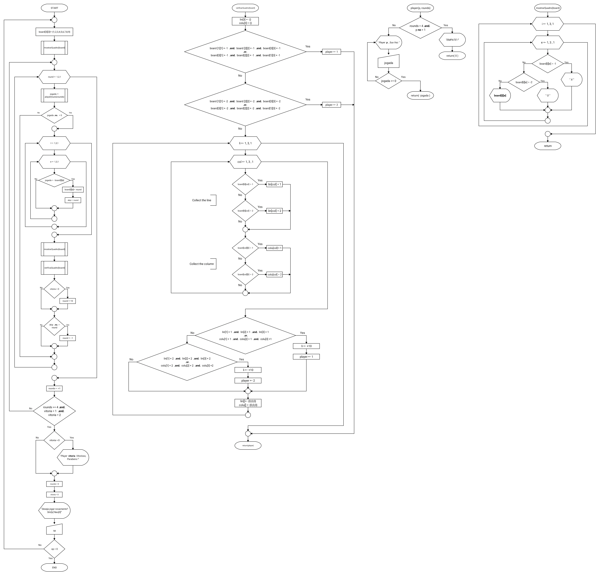
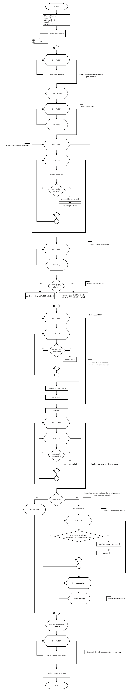
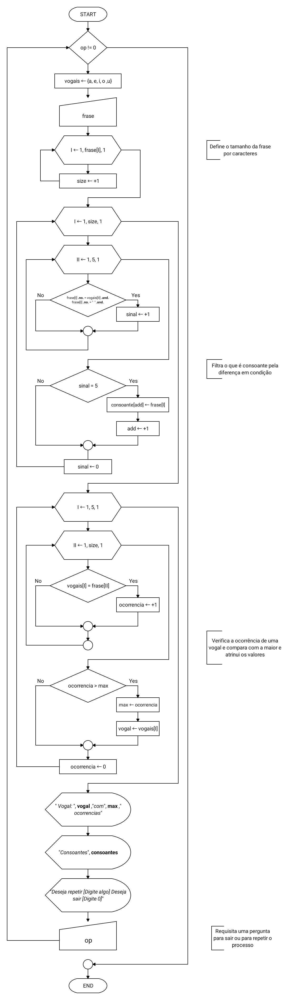
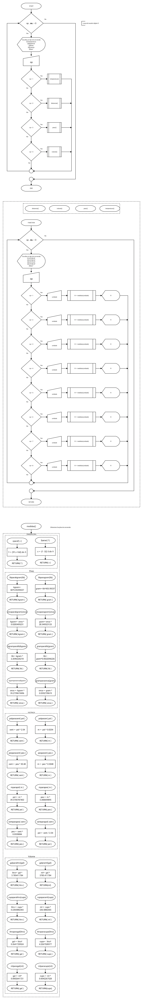

# ip
Individual Process

## Ex. 13 Jogo da Velha Fluxogram

## Ex.18 Estatística

## Ex.21 Ocorrencia de vogais

## Ex. 4-5-6-7-8-9-10 Menu Programa De Conversão (Simple)
#### Temperatura, Volume, Peso, Distância

