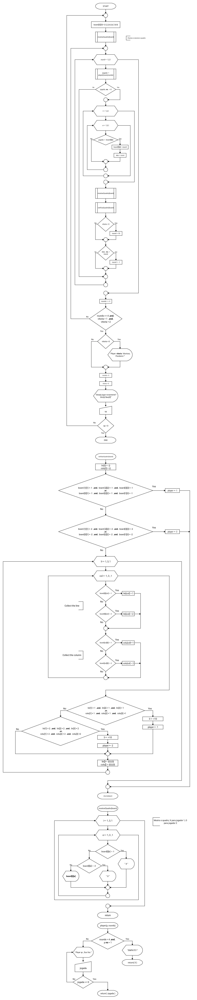

# ip
Individual Process

## [Ex.13](13-jogodavelha.c) Jogo da Velha Fluxogram :white_check_mark:

Flowchart 

---

## [Ex.18](18-estatistica.c) Estatística :white_check_mark:

Flowchart 

---

## [Ex.21](21-ocorrenciadevogais.c) Ocorrencia de vogais :white_check_mark:

Flowchart 

---

## [Ex.37](37-estudantecadastro.c) Alunos Cadastro :white_check_mark:

Flowchart 

---

## [Ex.39](39-onibusbilhete.c) Venda Bilhete Onibus :white_check_mark:

Flowchart 

---

## [Ex.36](36-clientesbanco.c) Clientes de Banco :white_check_mark:

Flowchart 

---

## [Ex.4-5-6-7-8-9-10](4-5-6-7-8-9-10-conversao.c) Menu Programa De Conversão (Simple) :white_check_mark:

Flowchart 

#### Temperatura, Volume, Peso, Distância

